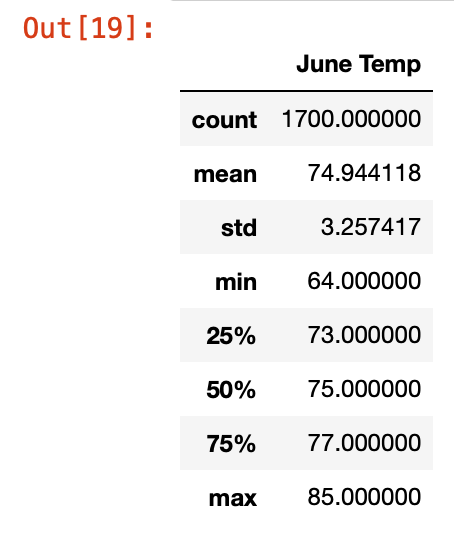
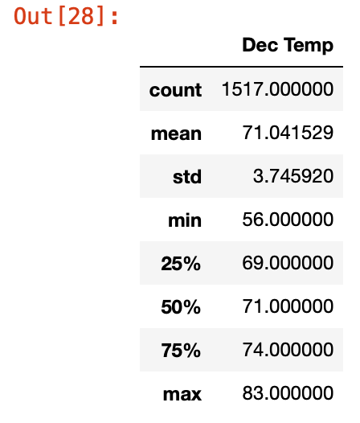

# surfs_up

Overview

The purpose of the analysis was to review a SQLite database to analyse the weather and precipitation for the town Oahu in Hawaii to make a well informed decision about a surf and icecream business. The weather data reviewed was for the year 2017.

Tools:
For the Precipitation and Weather Station analysis, some of the tools used included:
1.SQLite Dataset
2.SQLAlchemy library
3.Pandas
4.Numpy
5.Flask (to report on a web browser).
6.Python
7.Jupyter Notebooks.

Results:

1.The summary statistics for the month of June 2017 shows an average weather temperature of 74F with a minimum  temperature of 64F and a maximum temperature of 85F.

2.
The summary statistics for the month of December 2017 shows an average weather temperature of 71F with a minimum  temperature of 56F and a maximum temperature of 83F.

3.  There were 9 weather stations available in the dataset and the stations with the most data counts (most active stations) in descending order were (statins, count):

[('USC00519281', 2772),
 ('USC00519397', 2724),
 ('USC00513117', 2709),
 ('USC00519523', 2669),
 ('USC00516128', 2612),
 ('USC00514830', 2202),
 ('USC00511918', 1979),
 ('USC00517948', 1372),
 ('USC00518838', 511)]
 
 Summary:
 
 Average temperature of Oahu dropped as we moved from month of June to December 2017. Other exploratoray analysis will be to include precipitation data for the months of June and December. This will on the other hand inform about the chances of rainfall for the given month.The code will be as follow:
 
 
 June:
 
 
 june_temp = session.query(Measurement.date, Measurement.tobs,Measurement.prcp).filter(extract('month', Measurement.date) == 6).all()
print(june_temp)

December:

Dec_temp = session.query(Measurement.date, Measurement.tobs,Measurement.prcp).filter(extract('month', Measurement.date) == 12).all()
#print(Dec_temp)
